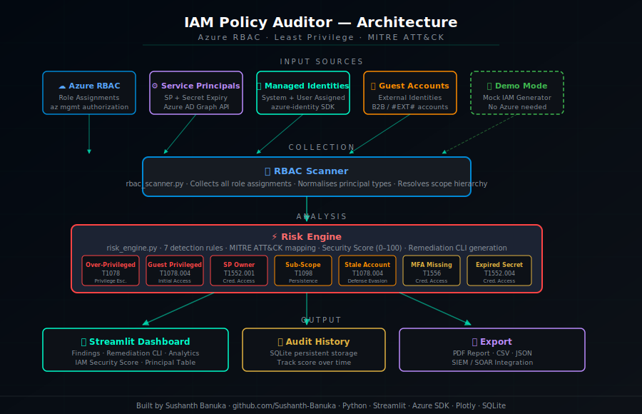
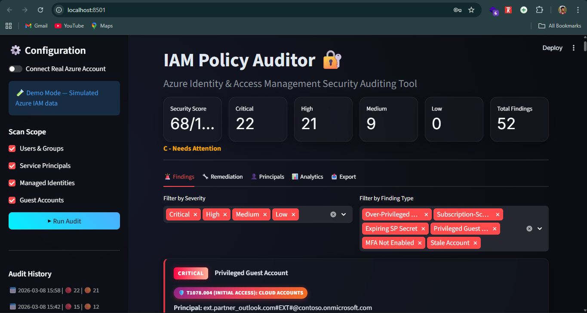
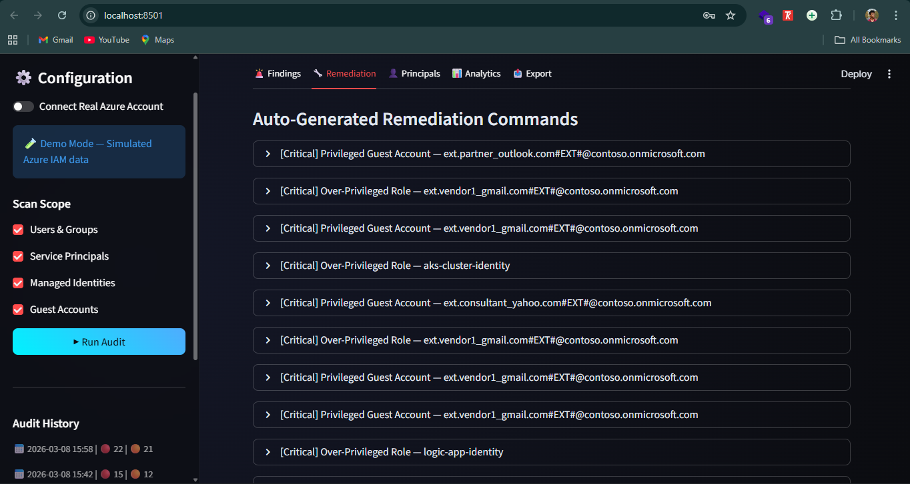
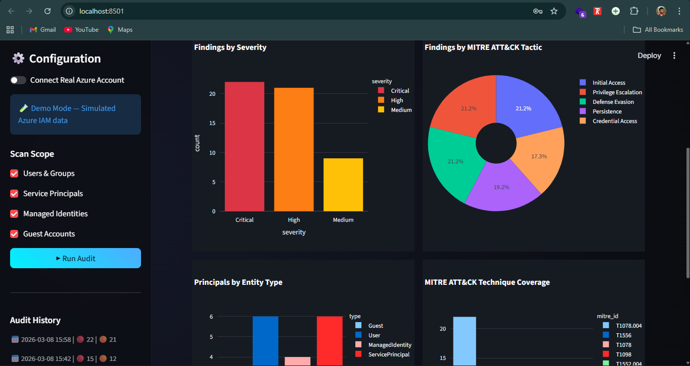
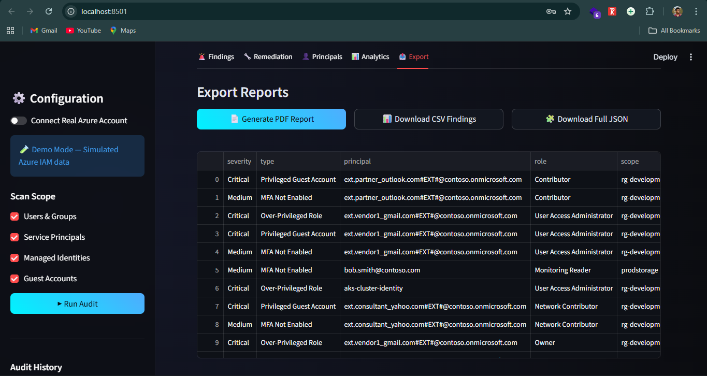

# IAM Policy Auditor 🔐

# Project Description & Purpose

The IAM Policy Auditor is an automated, Python-based cloud security tool designed to detect over-privileged Azure identities and IAM policy violations that silently expose organizations to critical attack vectors.

In modern cloud environments, Identity and Access Management is the most overlooked attack surface. Excessive role assignments, guest accounts with elevated privileges, stale identities, and over-scoped service principals accumulate over time — none of which Azure flags as errors. Attackers actively exploit these gaps using techniques documented in the MITRE ATT&CK framework (T1078, T1098, T1552, T1556).

This tool autonomously extracts all Azure RBAC role assignments across a subscription, evaluates each identity against 7 security detection rules based on the **Principle of Least Privilege**, computes an **IAM Security Score (0–100)**, and auto-generates **Azure CLI remediation commands** for every Critical and High finding — giving security teams immediate, actionable visibility into their identity posture.


# Demo Video

*Watch the full walkthrough of the IAM Policy Auditor in action:*

[](https://youtu.be/jdFuR9TP0UU)


# Architecture Diagram



*System Flow: Security Analyst → Streamlit Dashboard → Risk Engine (7 detection rules + MITRE ATT&CK mapping + Security Score) → Azure SDK (live RBAC scan) / Mock IAM Generator (demo mode) → SQLite Audit History → PDF Report + CSV + JSON Export*


# Dashboard Interface

**Main Dashboard — Security Score & Findings**



*Main dashboard showing the IAM Security Score (0–100 with letter grade), severity metric cards (Critical: 22, High: 21, Medium: 9, Low: 0, Total: 52), and the Findings tab displaying severity-coded finding cards with MITRE ATT&CK technique badges (e.g. T1078.004 — Initial Access: Cloud Accounts). Filter by Severity and Finding Type multiselects allow instant drill-down.*


**Automated Remediation Commands**



*Remediation tab listing all Critical and High findings as expandable cards. Each card shows the finding type, principal name, MITRE ATT&CK technique ID, and — when expanded — auto-generated Azure CLI commands (`az role assignment delete`, `az ad app credential reset`, `az ad user update`) that the security team can copy and execute directly.*


**Security Analytics**



*Analytics tab with 4 interactive Plotly charts: (1) Findings by Severity — bar chart showing Critical/High/Medium distribution; (2) Findings by MITRE ATT&CK Tactic — donut chart mapping findings to Initial Access, Privilege Escalation, Defense Evasion, Persistence, and Credential Access; (3) Principals by Entity Type — breakdown of Guest, User, ManagedIdentity, ServicePrincipal counts; (4) MITRE ATT&CK Technique Coverage — bar chart showing frequency of each technique (T1078.004, T1556, T1078, T1098, T1552.004).*


**Export Reports**



*Export tab with three download options — PDF Report (full audit with severity-colored finding cards and CLI blocks), CSV Findings (for Excel/Splunk), and Full JSON (for SIEM/SOAR integration like Microsoft Sentinel). The full findings table is displayed below with severity, type, principal, role, and scope columns.*


## Detected Issues & Impact

| Finding Type | Severity | Description | Why It Matters | Remediation Support |
|---|---|---|---|---|
| Over-Privileged Role | 🔴 Critical | Owner or User Access Administrator assigned to any identity | Full subscription control — one compromise = total takeover | Yes (`az role assignment delete` + safer role reassignment) |
| Privileged Guest Account | 🔴 Critical | External/guest account holds elevated role | External identities with high privilege = insider threat and supply chain risk | Yes (`az role assignment delete` + Reader reassignment) |
| Service Principal Owner | 🔴 Critical | Automated SP holds Owner role at subscription scope | SP credential leak = full automated subscription compromise | Yes (`az ad app credential reset` + Managed Identity migration) |
| Subscription-Scope Assignment | 🟠 High | Role assigned at subscription level instead of resource group | Blast radius extends to ALL resources in the subscription | Yes (`az role assignment delete` + scoped reassignment) |
| Stale Account | 🟠 High | User/guest inactive for 90+ days but retains active role assignments | Dormant accounts are prime targets for credential stuffing | Yes (`az role assignment delete` + `az ad user update --account-enabled false`) |
| Expired SP Secret | 🟠 High | Service Principal secret has passed its expiry date | Expired secrets suggest insecure workarounds are in use | Yes (`az ad app credential reset --years 1`) |
| MFA Not Enabled | 🟡 Medium | Human account lacks multi-factor authentication | Single-factor accounts vulnerable to phishing and password spray | Yes (Conditional Access Policy enforcement via Azure AD) |


# Technologies Used

**Python:** The core scripting, analysis, and automation language powering all detection logic and report generation.

**Azure Identity & Management SDKs:** `azure-identity` and `azure-mgmt-authorization` packages to authenticate via Service Principal and pull all role assignments directly from the Azure Resource Manager (ARM) API.

**Streamlit:** For rendering the interactive dark-mode dashboard with 5 functional tabs — Findings, Remediation, Principals, Analytics, and Export.

**Plotly:** For generating 4 interactive security analytics charts including MITRE ATT&CK tactic distribution and technique coverage heatmap.

**SQLite3:** Local database engine for persisting audit history across sessions and tracking Security Score trends over multiple scans.

**Pandas:** For principal data manipulation, findings filtering, and fast CSV/JSON serialization.

**FPDF2:** For generating structured, offline PDF audit reports with severity-colored finding cards and embedded Azure CLI remediation command blocks.


# Installation & Usage

# 1. Prerequisites
Ensure you have Python 3.10+ installed. Azure CLI (`az`) is optional — only required for live Azure scanning.

# 2. Clone the Repository
```bash
git clone https://github.com/Sushanth-Banuka/iam-policy-auditor.git
cd iam-policy-auditor
```

# 3. Set Up the Virtual Environment

**Windows (PowerShell):**
```powershell
python -m venv venv
.\venv\Scripts\Activate.ps1
```

**macOS/Linux:**
```bash
python3 -m venv venv
source venv/bin/activate
```

# 4. Install Dependencies
```bash
pip install -r requirements.txt
```

# 5. Run in Demo Mode (No Azure Account Needed)
```bash
streamlit run app.py
```
In the sidebar: toggle **off** "Connect Real Azure Account" → click **▶ Run Audit**

Demo mode uses a realistic mock IAM data generator simulating 21 principals across Users, Service Principals, Managed Identities, and Guest accounts.

# 6. Connect Real Azure Account (Optional)

**Step 1 — Create a Service Principal with Reader access:**
```bash
az ad sp create-for-rbac \
  --name "iam-auditor-app" \
  --role Reader \
  --scopes /subscriptions/<SUBSCRIPTION_ID>
```

**Step 2 — Add Security Reader role:**
```bash
az role assignment create \
  --assignee <SP_CLIENT_ID> \
  --role "Security Reader" \
  --scope /subscriptions/<SUBSCRIPTION_ID>
```

**Step 3 — Enter credentials in the sidebar:**
- Tenant ID
- Client ID (`appId` from Step 1 output)
- Client Secret (`password` from Step 1 output)
- Subscription ID

Then click **▶ Run Audit** to scan your live Azure tenant.


# Security Concepts Demonstrated

- **Principle of Least Privilege** — Core IAM security concept enforced across all 7 detection rules
- **RBAC Analysis** — Azure role-based access control review at subscription, resource group, and resource scope
- **Service Principal Security** — SP over-privilege detection and credential hygiene monitoring
- **Guest Account Risk** — External identity attack surface enumeration
- **Stale Identity Detection** — Dormant account identification as an attack vector
- **MITRE ATT&CK Mapping** — T1078 (Valid Accounts), T1098 (Account Manipulation), T1552 (Unsecured Credentials), T1556 (Modify Authentication Process)
- **IAM Security Scoring** — 0–100 metric for subscription-level identity health


# Academic Publication

This tool demonstrates the IAM audit component of cloud security posture management, complementing the following research:

> AUTONOMOUS CLOUD SECURITY POSTURE MANAGEMENT (ACSPM): An Event Driven Framwork For Real Time Misconfiguration Remedation
> 
> Mr.Sushanth Banuka 
>
> (https://ijnrd.org/papers/IJNRD2603361.pdf)


# Related Projects

Part of a 3-project Azure Cloud Security portfolio:

| Project | Focus | Link |
|---------|-------|------|
| 🔍 Cloud Misconfiguration Scanner | Detects public storage blobs, open NSG ports, unencrypted VMs, Key Vault misconfigurations | [GitHub](https://github.com/Sushanth-Banuka/cloud-misconfiguration-scanner) |
| 📊 Threat Detection Dashboard | Real-time threat monitoring with MITRE ATT&CK mapping and AbuseIPDB integration | [GitHub](https://github.com/Sushanth-Banuka/threat-detection-dashboard) |
| 🔐 IAM Policy Auditor | Azure RBAC least privilege enforcement with Security Score and CLI remediation | *(this project)* |


*Disclaimer: This tool is for educational and authorized auditing purposes only. Ensure you have explicit permission to scan the target Azure subscription before use.*
